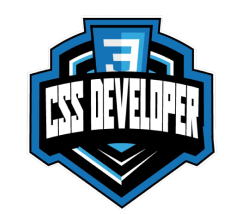

    

  

   Landing page do curso CSS Web Developer
     
    <a href="https://github.com/Mtheuxa/Landing-Page-Dio"><strong>Explore o documento »</strong></a>
     
     
    
  

## 💻 Sobre o projeto

Landing page do curso CSS Web Developer feita durante o desafio do Bootcamp da [DIO][Dio], cujo objetivo era desenvolver um projeto prático utilizando os três pilares do Front-end.

## 🔎 Preview do projeto

[![Preview do projeto][preview]](#🔎-preview-do-projeto)

## 🛠 Tecnologias

As seguintes ferramentas foram utilizadas no desenvolimento do projeto.

* 
* 

[Entre em contato!][linkedin]

<!-- LINKS E IMAGENS -->

[linkedin]: https://www.linkedin.com/in/matheuspaulucci/

[preview]: ./images/preview.png

[Dio]: https://www.dio.me

[html]: https://img.shields.io/badge/HTML-239120?style=for-the-badge&logo=html5&logoColor=orange
[html-url]: https://developer.mozilla.org/en-US/docs/Web/HTML

[css]: https://img.shields.io/badge/-CSS-blue?style=for-the-badge&logo=css3&logoColor=white
[css-url]: https://www.w3.org/Style/CSS/Overview.en.html
